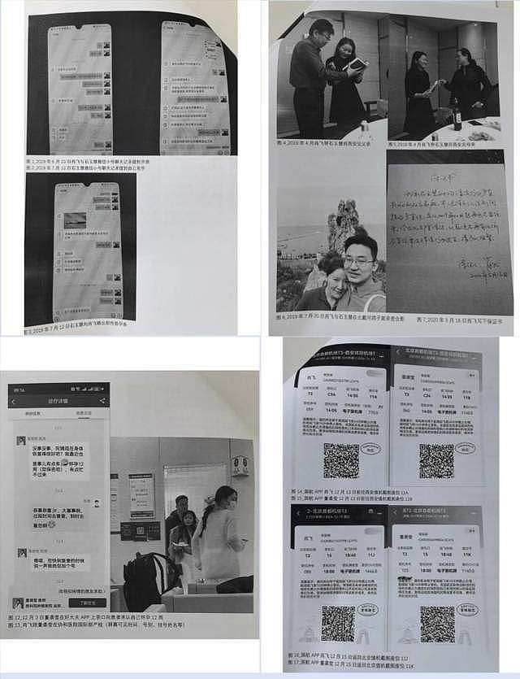
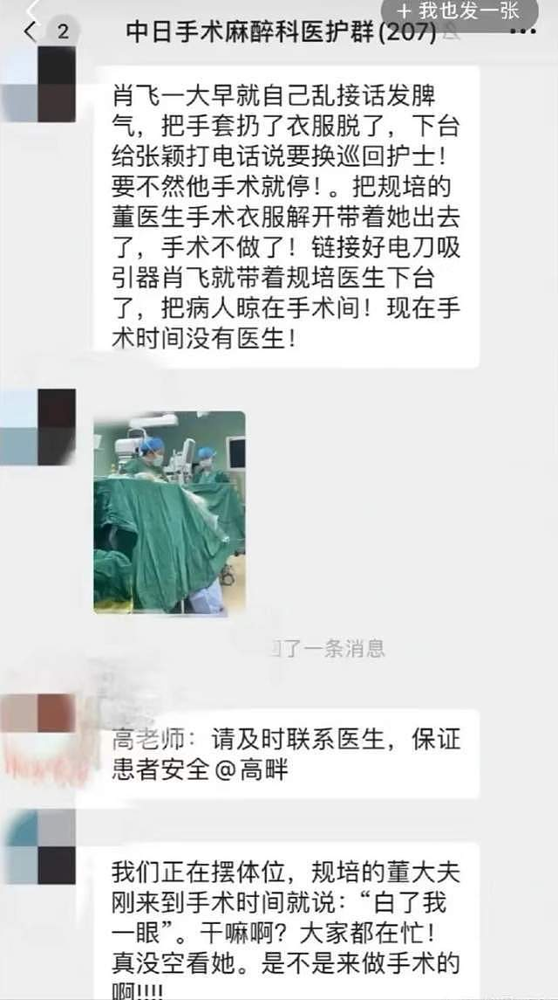
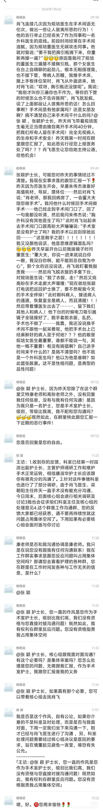
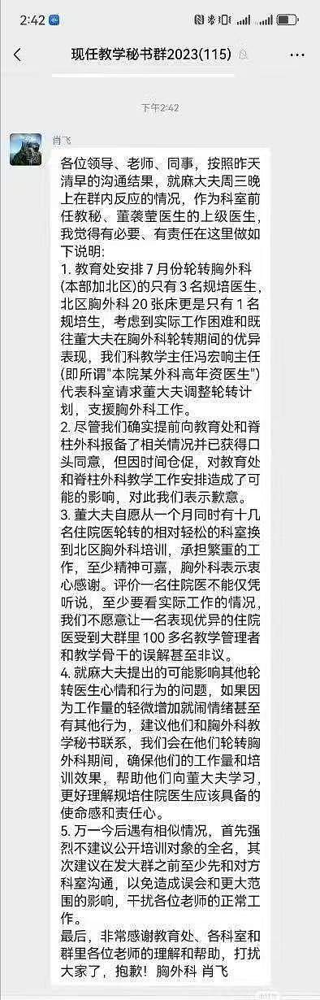

# 简介
4月25日，一封实名举报信在网上热传。举报内容显示，2019年2月至2025年4月，‌北京中日友好医院‌胸外科副主任医师‌肖某‌婚内出轨至少4人，包括护士长‌和规培医生‌，涉及多名女性怀孕，且存在因情感原因置已被麻醉患者不顾，长时间离开手术室情况。

中日友好医院官网信息显示，肖飞毕业于北京大学医学部，获外科学博士学位。2017年7月至2018年8月在美国Mayo Clinic医学中心和Washington University in St.Louis医学院任访问学者。2012年起，历任中日友好医院胸外科住院医师、主治医师、副主任医师。还担任北京协和医学院硕士研究生导师。

4月27日晚，记者注意到，中日友好医院官网仍有肖某的个人资料。记者登录该医院的微信小程序，仍能搜到肖某的个人信息，但预约挂号系统显示，其名下已无可预约号源。

随着热心民众和记者的深入挖掘，董袭莹还涉嫌学术经历重重造假，协和4+4培养方式也问题乍现。

# 官方通报：基本属实
4月27日晚间，中日友好医院发布情况通报：近日，我院收到实名举报材料，反映胸外科副主任医师肖某违反生活纪律和医德医风问题。

中日友好医院高度重视，立即组织调查核实工作，并第一时间对肖某作出停职处理决定。经核查，举报材料反映的肖某个人问题基本属实。中日友好医院根据相关规定，对肖某予以开除党籍处分，并解除聘用关系。

中日友好医院始终将医疗质量和患者安全放在首位，高度重视党风党纪、医德医风工作，将持续加强行业作风建设，对违法违纪违规行为严惩不贷、绝不姑息，坚决维护风清气正环境。

# [关于胸外科肖飞多次婚内出轨、意图非婚生子的举报信](1关于胸外科肖飞多次婚内出轨、意图非婚生子的举报信.md)

# [关于胸外科护士长石玉慧生活作风问题的举报信](2关于胸外科护士长石玉慧生活作风问题的举报信.md)

# [关于泌尿外科董袭莹破坏他人家庭，意图非婚生子的举报信](3关于泌尿外科董袭莹破坏他人家庭，意图非婚生子的举报信.md)

# 相关图片

# [董袭莹博士论文](10023_b2019012012董袭莹博士论文.pdf)
